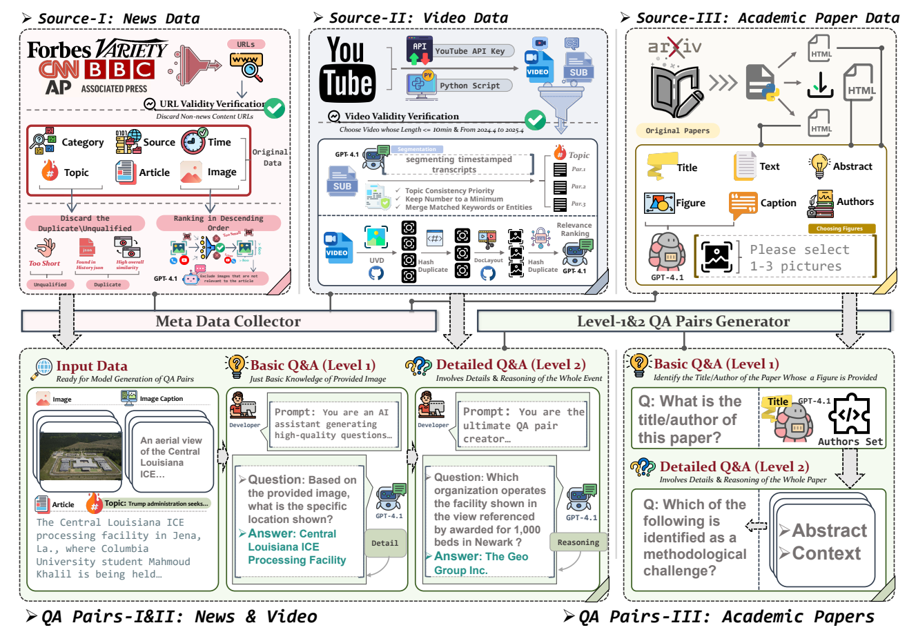








# Hi, I am Yuyang Peng (彭雨洋). # 

I am **seeking** a PhD offer for Fall 2027, and I am **very keen on securing an internship opportunity** as soon as possible. Please contact me at **yuyangpeng@hust.edu.cn**.

My main research interests lie in **multimodal large-language models** and **multi-agent systems**.

# 📝 Publications 

NeurIPS 2025

**Seeking and Updating with Live Visual Knowledge** [[PDF]](https://arxiv.org/pdf/2504.05288)[[Github]](https://github.com/fumingyang2004/LIVEVQA)[[Website]](https://livevqa.github.io/)[[Data]](https://huggingface.co/datasets/ONE-Lab/LiveVQA-new/tree/main)

Mingyang Fu*,  **Yuyang Peng***, Dongping Chen, Zetong Zhou, Benlin Liu, Yao Wan, Zhou Zhao, Philip S. Yu, Ranjay Krishna

(* Equal contribution)

Github Project

**ULMEvalKit: One-Stop Eval ToolKit for Image Generation**[[Github]](https://github.com/ULMEvalKit/ULMEvalKit)

Dongzhi Jiang, Renrui Zhang, Yankai Shu, **Yuyang Peng**, Zhuofan Zong, Yuchen Duan, etc.

Github Project

**LIVEVQA: Assessing Models with Live Visual Knowledge**[[PDF]](https://openreview.net/pdf?id=sLFrSp7xNs)

Mingyang Fu*,  **Yuyang Peng***, Benlin Liu, Yao Wan, Dongping Chen

(* Equal contribution)

# 🎖 Honors and Awards
- CCF Elite Collegiate Award (2025)
- Golden Medal, ACM-CCPC Girls' Division(2024)
- Silver Medal, ACM-ICPC Asia Shenyang Regional Contest (2024)
- Bronze Medal, National Olympiad in Informatics (NOI) (2021)

# 📖 Educations
- *2023.09 - 2027.06(expected)*, CS(Turing), Huazhong University of Science and Technology. 
