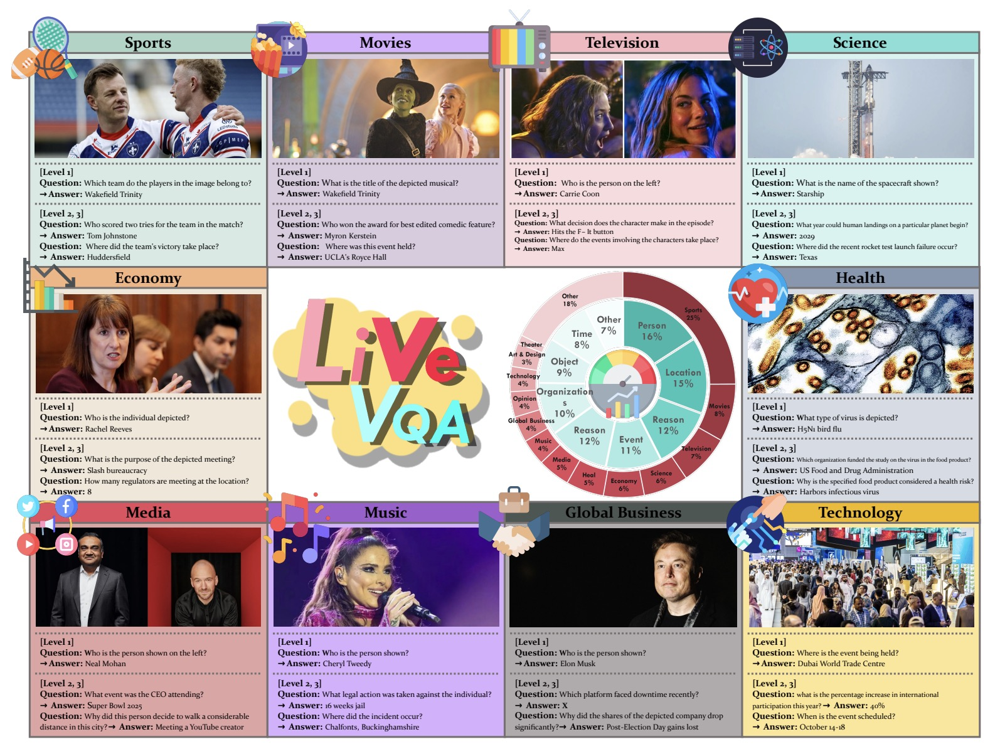








# Hi, I am Yuyang Peng (彭雨洋). #

At present, I am working with Professor Yao Wan at HUST.

My research interests are deeply rooted in the latest advancements in generative models, especially multimodal.

# 📝 Publications 

CVPR 2025 Workshop

[LIVEVQA: Assessing Models with Live Visual Knowledge](https://openreview.net/pdf?id=sLFrSp7xNs)

Mingyang Fu, **Yuyang Peng**, Benlin Liu, Yao Wan, Dongping Chen

# 🎖 Honors and Awards
- Silver Medal, ACM-ICPC Asia Shenyang Regional Contest (2024)
- Bronze Medal, National Olympiad in Informatics (NOI) (2021)

# 📖 Educations
- *2023.09 - 2027.06(expected)*, CS(Turing), Huazhong University of Science and Technology. 

