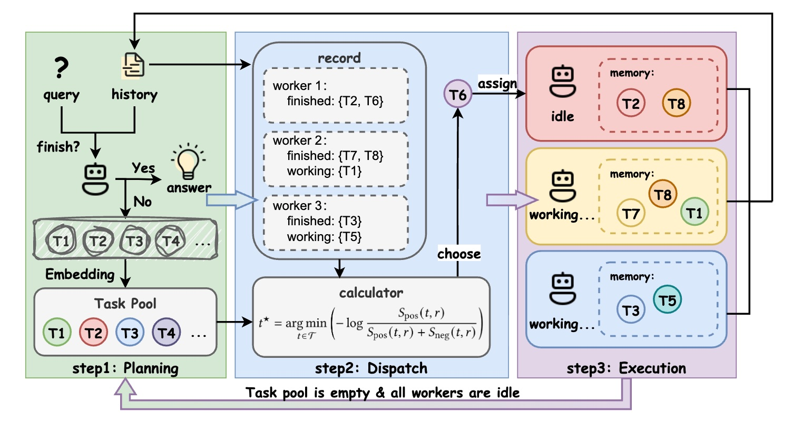
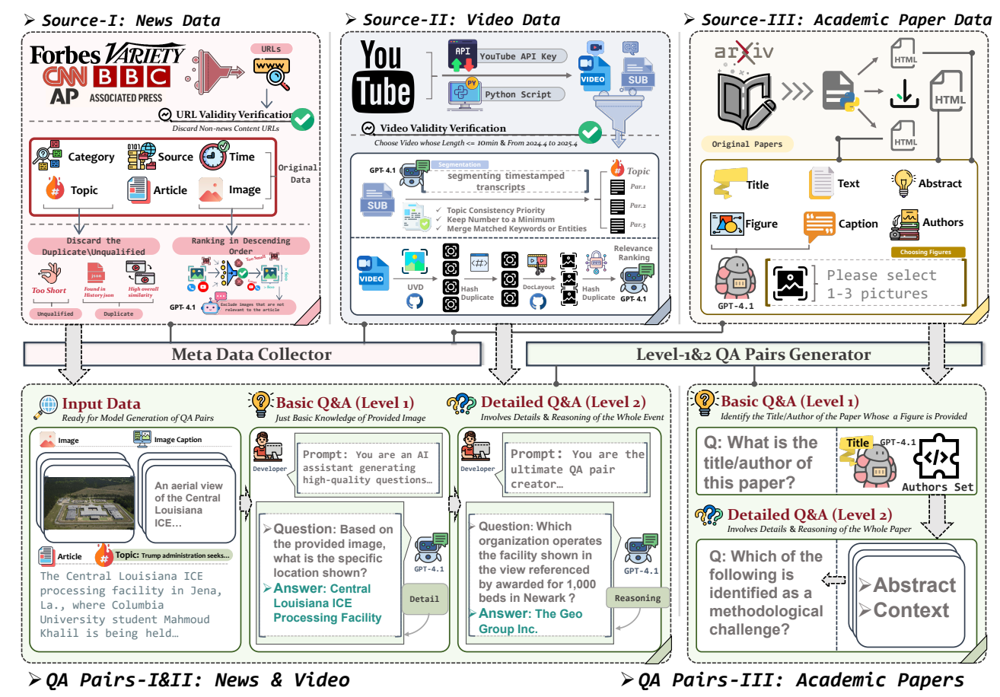
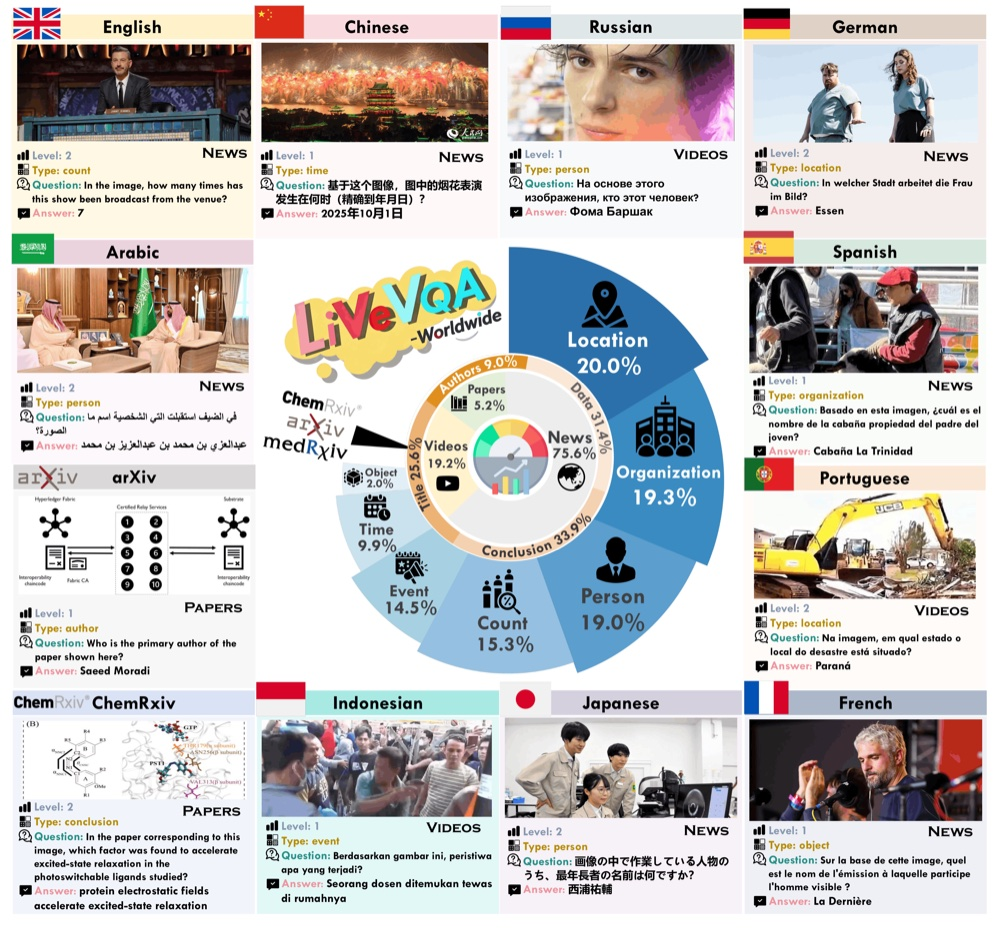
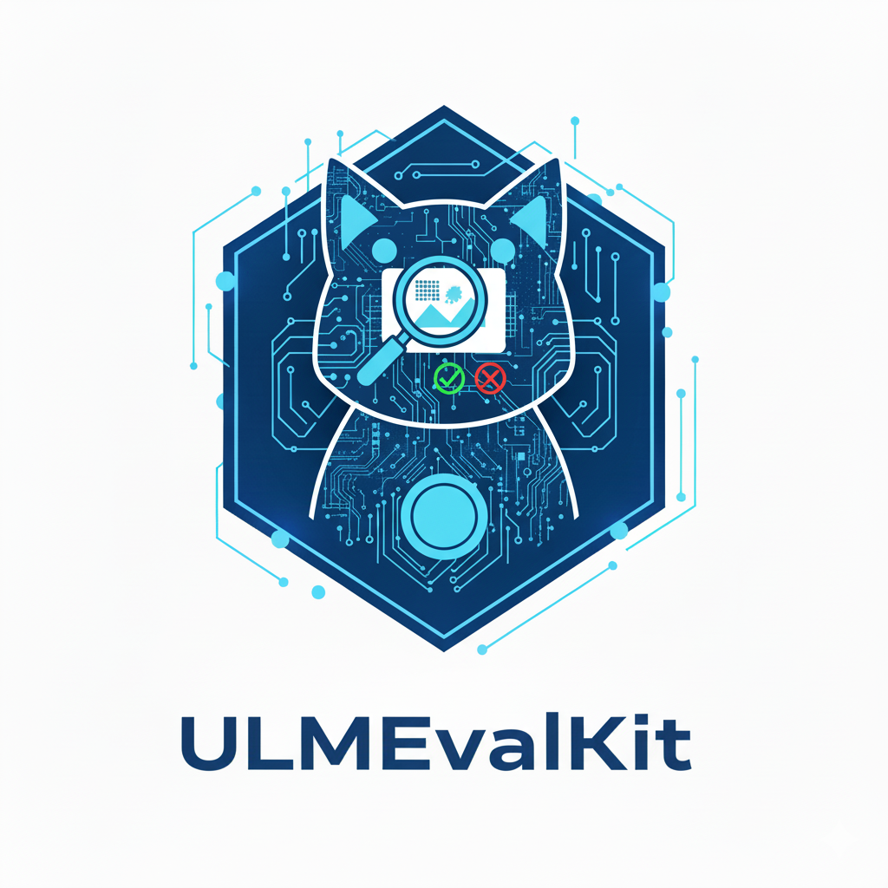
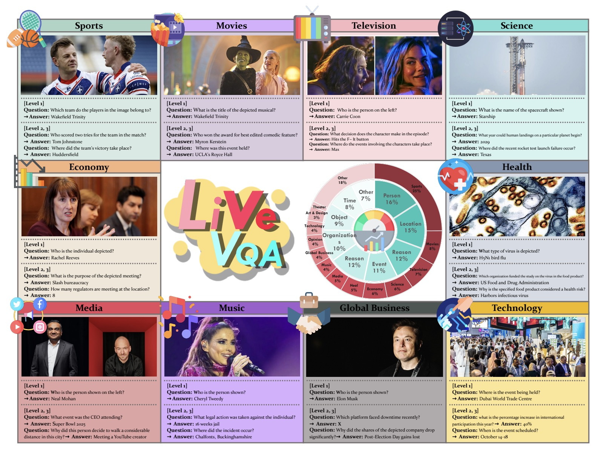








Yuyang Peng (彭雨洋) is an undergraduate student at the College of Computer Science.

Her main research interests lie in **multimodal large-language models**, **multi-agent systems** and **computer vision**.

# 📝 Publications 

KDD 2026

**Parallelizing LLM Agent Execution with Contrastive Task Allocation** [[PDF]](https://dl.acm.org/doi/pdf/10.1145/3770855.3817872)

**Yuyang Peng***, Yanling Xu*, Shuyi Wang, Xiaofei Liao, Qinbin Li

(* Equal contribution)

NeurIPS 2025

**Seeking and Updating with Live Visual Knowledge** [[PDF]](https://arxiv.org/pdf/2504.05288)[[Github]](https://github.com/fumingyang2004/LIVEVQA)[[Website]](https://livevqa.github.io/)[[Data]](https://huggingface.co/datasets/ONE-Lab/LiveVQA-new/tree/main)

Mingyang Fu*,  **Yuyang Peng***, Dongping Chen, Zetong Zhou, Benlin Liu, Yao Wan, Zhou Zhao, Philip S. Yu, Ranjay Krishna

(* Equal contribution)

ACL 2026 Findings

**Worldwide LiveVQA: Real-Time Visual Knowledge Seeking and Updating Across Languages** [[PDF]](https://aclanthology.org/2026.findings-acl.1984.pdf)[[Github]](https://github.com/huangxuanao/Worldwide-LiveVQA)[[Website]](https://worldwide-livevqa.github.io/)[[Data]](https://huggingface.co/datasets/reiofa/Worldwide-LiveVQA)

Xuanao Huang*, Xingjia Liu*, Zetong Zhou, **Yuyang Peng**, Yao Wan, Dongping Chen

(* Equal contribution)

Github Project

**ULMEvalKit: One-Stop Eval ToolKit for Image Generation**[[Github]](https://github.com/ULMEvalKit/ULMEvalKit)

Dongzhi Jiang, Renrui Zhang, Yankai Shu, **Yuyang Peng**, Zhuofan Zong, Yuchen Duan, etc.

CVPR2025 Workshop

**LIVEVQA: Assessing Models with Live Visual Knowledge**[[PDF]](https://openreview.net/pdf?id=sLFrSp7xNs)

Mingyang Fu*,  **Yuyang Peng***, Benlin Liu, Yao Wan, Dongping Chen

(* Equal contribution)

# 🎖 Honors and Awards
- CCF Elite Collegiate Award (2025)
- Golden Medal, ACM-CCPC Girls' Division(2024)
- Silver Medal, ACM-ICPC Asia Shenyang Regional Contest (2024)
- Bronze Medal, National Olympiad in Informatics (NOI) (2021)

# 📖 Educations
- *2023.09 - 2027.06(expected)*, CS(Turing), Huazhong University of Science and Technology. 
